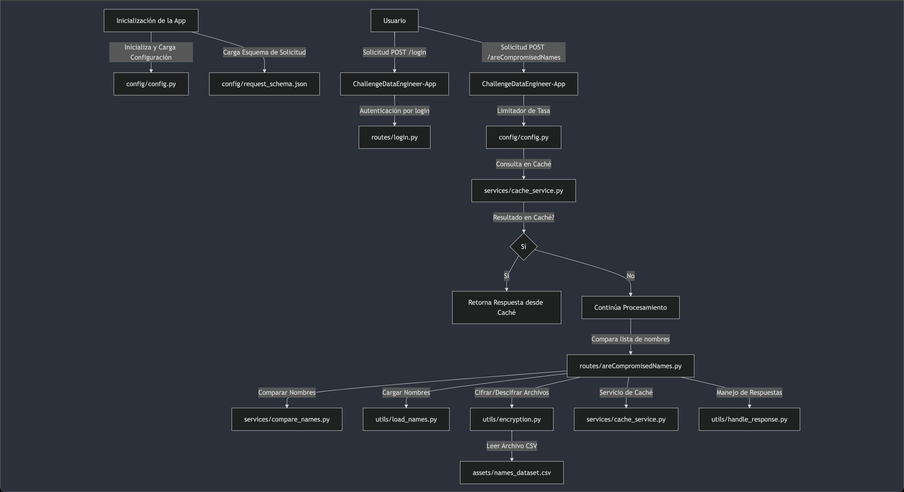

# Introducción

En este proyecto, se nos encargó diseñar un sistema de screening de usuarios para una plataforma en línea. La plataforma tenía la necesidad de evitar que los usuarios se registraran utilizando nombres comprometidos o inapropiados. Para abordar este problema, se diseñó un sistema que verifica si un nombre de usuario está en una lista de nombres comprometidos antes de permitir el registro.

### Solución Propuesta

Para satisfacer estas necesidades, se diseñó un sistema utilizando Flask como framework web, con soporte para JWT para la autenticación y Flask-Limiter para la limitación de la tasa de solicitudes. La lista de nombres comprometidos se almacena en un archivo CSV cifrado, y se implementó un servicio de caché para optimizar el rendimiento. El sistema también incluye validación de esquemas JSON para asegurar que las solicitudes cumplan con el formato esperado. Además, se consideró la opción de restringir el acceso a los endpoints por dirección IP, como una medida adicional para garantizar la privacidad de los datos. Se asume que la aplicación será utilizada internamente.

El sistema está organizado en varios módulos: rutas para manejar las solicitudes, servicios que contienen la lógica de negocio y utilidades para tareas comunes como el cifrado y la carga de nombres. Esta arquitectura modular facilita tanto la mantenibilidad como la escalabilidad del sistema.

## Configuración del proyecto

Asegúrate de tener el archivo de configuración config.json en el directorio config/. Este archivo debe contener las claves necesarias para la configuración del proyecto, como env_encryption_key y env_JWT_SECRET_KEY.

```json
{
    "env_encryption_key": "TU_CLAVE_DE_CIFRADO",
    "env_JWT_SECRET_KEY": "TU_CLAVE_SECRETA_JWT",
    "default_limits": "60 per minute"
}
```

## Ejecutar la Aplicación

Para ejecutar la aplicación en modo desarrollo, utiliza el siguiente comando:

```
python app.py
```

La aplicación estará disponible en http://127.0.0.1:5000.

## Autenticación en Local

Enviar una Solicitud de Inicio de Sesión: Envía una solicitud POST al endpoint /login con las credenciales de usuario. La solicitud debe incluir un cuerpo JSON con los campos username y password.

Ejemplo de Solicitud:

```bash
curl -X POST http://localhost:5000/login \
-H "Content-Type: application/json" \
-d '{"username": "test", "password": "test"}'
```

> En el ambiente local, solamente funciona con estas credenciales

## Endpoints Disponibles

### POST /login

- **Descripción:** Autentica a un usuario mediante credenciales.
- **Ruta:** `routes/login.py`
- **Parámetros:**
  - `username`: Nombre de usuario.
  - `password`: Contraseña del usuario.
- **Respuesta:**
  - `200 OK`: Devuelve un token JWT si la autenticación es exitosa.
  - `401 Unauthorized`: Si las credenciales son incorrectas.

### POST /areCompromisedNames

- **Descripción:** Compara una lista de nombres para determinar si están comprometidos.
- **Ruta:** `routes/areCompromisedNames.py`
- **Parámetros:**
  - `names`: Lista de nombres a comparar.
- **Respuesta:**
  - `200 OK`: Devuelve los nombres comprometidos.
  - `429 Too Many Requests`: Si se excede el límite de tasa.
  - `400 Bad Request`: Si la solicitud no cumple con el esquema definido.

### GET /status

- **Descripción:** Verifica el estado del servicio.
- **Ruta:** `routes/status.py`
- **Respuesta:**
  - `200 OK`: Devuelve el estado del servicio.

## Diagrama de Arquitectura



## Descripción de Componentes

| Componente                                             | Archivo                         | Descripción                                                                                                                 |
| ------------------------------------------------------ | ------------------------------- | --------------------------------------------------------------------------------------------------------------------------- |
| Inicialización de la App                               | `app.py`                        | Inicializa la aplicación Flask, carga la configuración y el esquema de solicitud, y registra los blueprints para las rutas. |
| Configuración                                          | `config/config.py`              | Contiene funciones para cargar la configuración (`load_config`) y el esquema de solicitud (`load_request_schema`).          |
| Esquema de Solicitud                                   | `config/request_schema.json`    | Define el esquema JSON para validar las solicitudes de comparación de nombres.                                              |
| Autenticación por Login                                | `routes/login.py`               | Maneja la autenticación de usuarios mediante un endpoint POST `/login`.                                                     |
| Comparación de Nombres Comprometidos | `routes/areCompromisedNames.py` | Compara una lista de nombres para determinar si están comprometidos mediante un endpoint POST `/areCompromisedNames`.                                                     |
| Verificación de Estado                                | `routes/status.py`               | Proporciona un endpoint para verificar el estado del servicio mediante un endpoint GET `/status`.                                                     |
| Servicio de Caché                                      | `services/cache_service.py`     | Proporciona funcionalidades de caché para almacenar y recuperar resultados de comparación de nombres.                       |
| Comparación de Nombres                                 | `services/compare_names.py`     | Contiene la lógica para comparar nombres y determinar si están comprometidos.                                               |
| Carga de Nombres                                       | `utils/load_names.py`           | Proporciona funciones para cargar nombres desde un archivo CSV.                                                             |
| Cifrado y Descifrado de Archivos                       | `utils/encryption.py`           | Contiene funciones para cifrar y descifrar archivos.                                                                        |
| Manejo de Respuestas                                   | `utils/handle_response.py`      | Proporciona funciones para manejar y formatear las respuestas de la API.                                                    |
| Dataset de Nombres                                     | `assets/names_dataset.csv`      | Archivo CSV que contiene la lista de nombres a comparar.                                                                    |


## Librerías Usadas

- **Flask:** Seleccionado por su simplicidad y flexibilidad para construir aplicaciones web ligeras.
- **Flask-JWT-Extended:** Utilizado para manejar la autenticación basada en tokens JWT.
- **Flask-Limiter:** Implementado para proteger la API de abusos mediante limitación de tasa.
- **JSONSchema:** Utilizado para validar las solicitudes entrantes, asegurando que cumplan con el esquema definido.
- **Cryptography:** Se utiliza para implementar funciones de cifrado y descifrado de datos sensibles. 
- **Caché:** Implementado para mejorar el rendimiento y reducir la carga del sistema al almacenar resultados de comparación de nombres.

## Recomendaciones para el Despliegue de la Aplicación

### Configuración del entorno:

Asegúrate de que las variables de entorno sensibles, como `env_encryption_key` y `env_JWT_SECRET_KEY`, no estén hardcodeadas en el código. Utiliza un archivo `.env` o un gestor de secretos, como Fury Secrets.

**Configuración del Limite de la Tasa de Solicitudes**

El parámetro `default_limits` en el archivo `config.json` define los límites de tasa predeterminados para la aplicación `Flask`, usando la extensión `Flask-Limiter`. Este valor se puede ajustar para controlar el número de solicitudes permitidas por unidad de tiempo, ayudando a gestionar el tráfico y prevenir abusos. Por ejemplo:

1. Configuración actual: Limite de 60 solicitudes por minuto. 
```
{
    "default_limits": "60 per minute"
}
```
2. Configuración modificada: Nuevo límite de 100 solicitudes por minuto.
```
{
    "default_limits": "100 per minute"
}
```

## Implementación Actual de la Caché y Posibles Mejoras

Actualmente, la caché en el proyecto se implementa utilizando un diccionario en memoria para almacenar los resultados de las comparaciones de nombres. Aunque esta solución es funcional, presenta limitaciones como la falta de persistencia entre reinicios, problemas de escalabilidad a medida que aumenta el volumen de datos, la ausencia de un mecanismo de expiración de entradas, y posibles conflictos en entornos concurrentes. Esta implementación se encuentra en el archivo `services/cache_service.py` y está definida de la siguiente manera:

```
cache = {}
```

**Mejoras Propuestas**

Para abordar estas limitaciones, se recomienda implementar una caché distribuida como Redis o Memcached, lo que permitiría una mayor escalabilidad, persistencia de datos y un manejo más eficiente de la memoria. Además, se debería añadir un mecanismo de tiempo de vida (TTL) para las entradas de la caché, evaluar el uso de una base de datos ligera como SQLite para la persistencia, y aplicar mecanismos de bloqueo para evitar inconsistencias en entornos con acceso concurrente.

### Autenticación

Actualmente, el endpoint `/login` está configurado solo para el desarrollo local, utilizando credenciales estáticas (ambos valores de username y password son "test"). Para un despliegue en producción, es imprescindible implementar un sistema de autenticación más robusto y seguro, con manejo adecuado de credenciales y almacenamiento seguro de contraseñas.

### Tests

Antes de realizar el despliegue, es esencial llevar a cabo pruebas exhaustivas para garantizar que los endpoints funcionen correctamente y que el sistema sea robusto. A continuación se detallan algunas pruebas clave:

1. **Pruebas de Autenticación:**
   - Verificar que el endpoint `/login` autentique correctamente a los usuarios con credenciales válidas y que se generen y devuelvan tokens JWT válidos.
   - Probar el manejo de credenciales inválidas y la devolución de mensajes de error apropiados.

2. **Pruebas de Integridad de Datos:**
   - Evaluar el endpoint `/areCompromisedNames`, enviando diferentes nombres y umbrales de similitud, y verificar que los resultados incluyan los campos correctos (name, similarity) y estén ordenados adecuadamente.

3. **Pruebas de Validación de Esquema:**
   - Enviar datos que no cumplan con el esquema JSON definido en `request_schema.json` para comprobar la correcta gestión de errores de validación.

4. **Pruebas de Rendimiento:**
   - Realizar pruebas de carga para evaluar el comportamiento bajo alta demanda, y verificar que el límite de tasa definido en `config.json` sea respetado.

5. **Pruebas de Seguridad:**
   - Asegurarse de que los endpoints protegidos solo se puedan acceder mediante un token JWT válido y probar el manejo de tokens expirados o inválidos.

6. **Pruebas de Integración:**
   - Verificar la integración entre los diferentes módulos de la aplicación y asegurarse de que las funciones de carga y cifrado funcionen correctamente con los endpoints.

Estas pruebas garantizarán que la aplicación esté lista para ser desplegada de manera segura y eficiente en un entorno de producción, brindando una experiencia confiable para los usuarios finales.